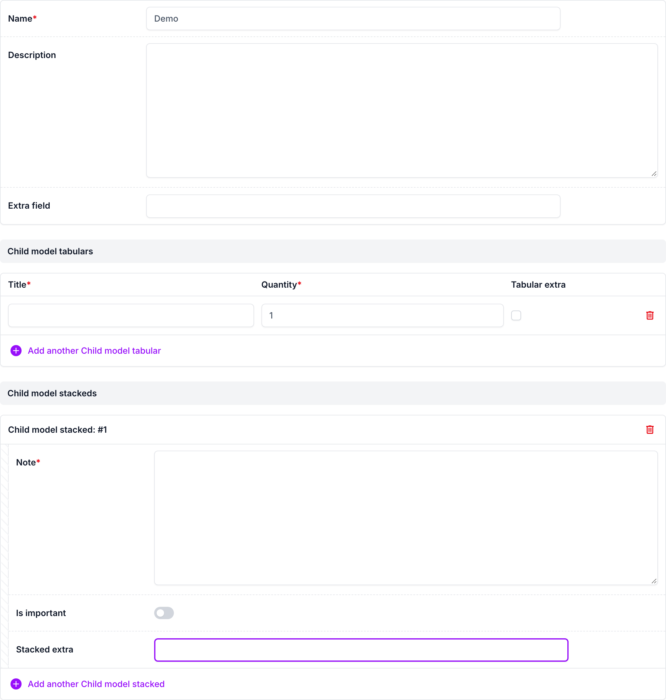
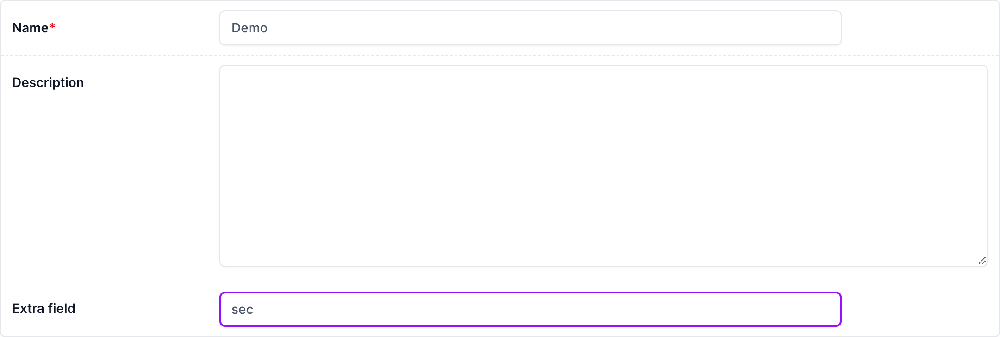
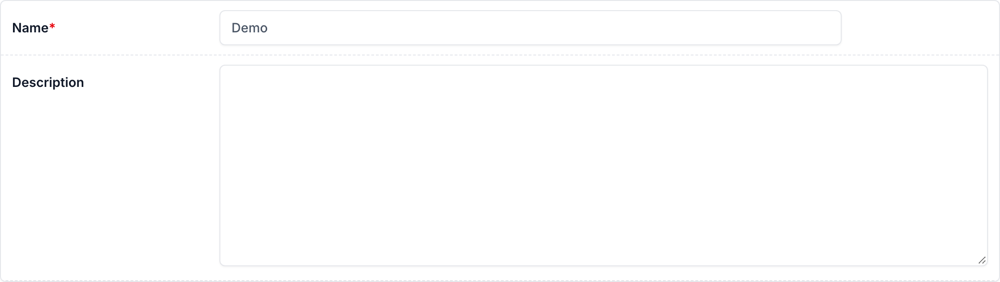

# django-form-alpine with django-unfold

## Usage

With [django-unfold](https://unfoldadmin.com/), use `UnfoldAdminAlpineMixin` instead of `AdminAlpineMixin`, on the `ModelAdmin` and on the forms — the same directives, with Unfold's markup:

```python
from unfold.admin import ModelAdmin
from django_form_alpine.contrib.unfold import UnfoldAdminAlpineMixin


class ParentModelForm(UnfoldAdminAlpineMixin, forms.ModelForm):
    ...


@admin.register(ParentModel)
class ParentModelAdmin(UnfoldAdminAlpineMixin, ModelAdmin):
    form = ParentModelForm
```

Unfold already loads Alpine.js, so the mixin doesn't load a second one: it loads `contrib/unfold.js` (the admin preset's resolvers for Unfold's markup) and `core.js` as plain scripts, which apply the directives on `alpine:init`, right before Unfold's Alpine starts. The resolvers keep the admin preset's names:

| Prefix | Target in Unfold |
| --- | --- |
| `form-row`, `form-multiline` | Closest `.form-row` (a row of one or more fields) |
| `form`, `fieldset`, `option-label`, `td` | As in the admin preset |
| `field-box`, `field-container` | The field's `.field-line` (label, input, help and errors), or its `td` in a tabular inline |
| `label`, `errorlist`, `help` | Inside the field's `.field-line` |
| `inline-container` | The inline form's `.form-group` |
| `nonfield-errorlist` | The inline form's non-field errors |

`__row_prefix__` works too: Unfold's inline rows have no id, so the prefix comes from the field's name. Tested with django-unfold 0.108.

Unfold only styles its own widgets: for fields you declare on a form
yourself, use Unfold's (`unfold.widgets.UnfoldAdminTextInputWidget`, …) with
the same Alpine attrs; the model's fields get them from Unfold's
`ModelAdmin`.

```python
from unfold.widgets import UnfoldAdminTextInputWidget


class ParentModelForm(UnfoldAdminAlpineMixin, forms.ModelForm):
    extra_field = forms.CharField(
        required=False,
        widget=UnfoldAdminTextInputWidget(
            attrs={
                "x-add-model-data": "extraFieldState",
                "x-form-row-show": 'extraFieldState != "secret"',
            }
        ),
    )
```

## Screenshots

The demo's form, with directives in the parent form, a tabular and a
stacked inline:



`x-form-row-show` on "Extra field": its row is shown while the value isn't
`secret`…



…and hidden as soon as it is:



## Demo

```bash
cd example
DJANGO_SETTINGS_MODULE=settings_unfold python manage.py runserver
```
